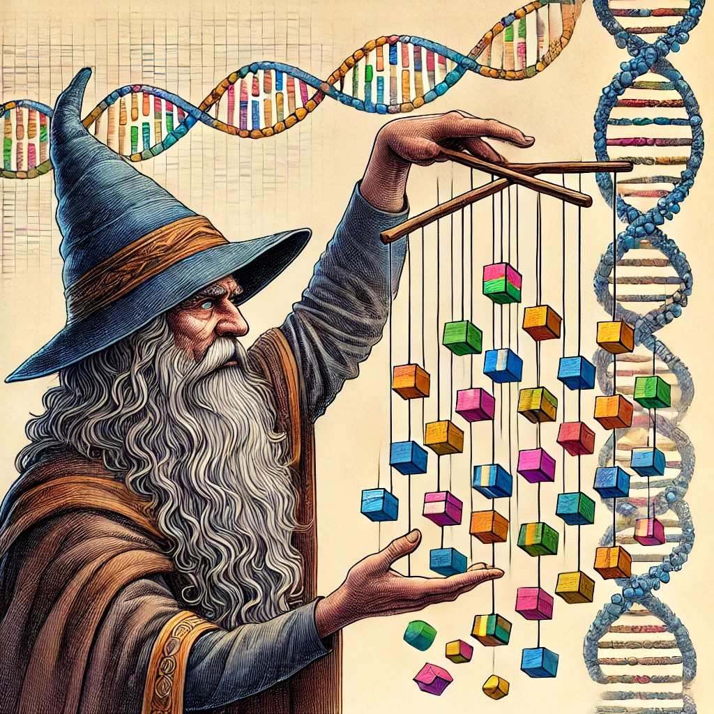
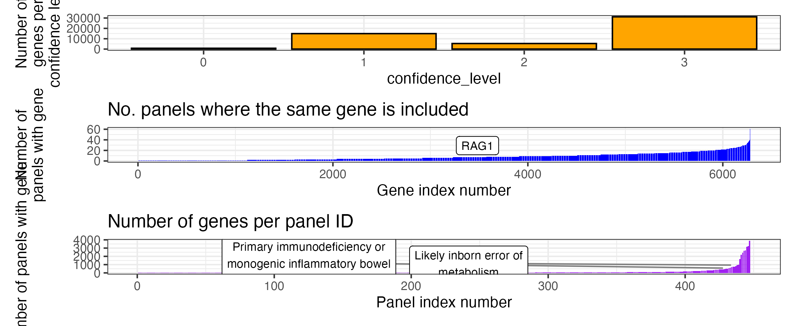

# PanelAppRex
Aggregating and analysing gene panel data in R from Genomics England



## Overview
PanelAppRex is an R project aimed at aggregating and analysing gene panel data from Genomics England's PanelApp. Our repository integrates data that is used in both the NHS National Genomic Test Directory and the virtual gene panels used in the 100,000 Genomes Project. This dataset facilitates research and development by providing insights into disease-gene correlations and enhancing variant classification methodologies.
View the original GE panels here <https://panelapp.genomicsengland.co.uk/panels/> to browse and manually download single panels. 

## What you want

PanelAppRex skips the hard work by performing credentialed access to Genomics England API where it retrieves all gene panels, including the approved "451" panels.

All panels are merged into single tables for your use:
* **Simplified** (Panel ID, Gene)
    - [./data/PanelAppData_combined_minimal.tsv](https://github.com/DylanLawless/PanelAppRex/blob/main/data/PanelAppData_combined_minimal.tsv)
* **Complex** (Panel id, Gene, confidence_level, mode_of_inheritance, name, disease_group, disease_sub_group, status)
    - [./data/PanelAppData_combined_core.tsv](https://github.com/DylanLawless/PanelAppRex/blob/main/data/PanelAppData_combined_core.tsv)

## Example import with R

For the full code used see `./src/genomics_england_panels.R`.

You can import either the TSV format or Rds format.
The following code is shown in `minimal_example.R`:

```
# TSV format
path_PanelAppData_genes_combined_core <- paste0(path_data, "/PanelAppData_combined_core")
path_PanelAppData_genes_combined_minimal <- paste0(path_data, "/PanelAppData_combined_minimal")
df_core <- read.table(file= paste0(path_PanelAppData_genes_combined_core, ".tsv"), sep = "\t")
df_minimal <- read.table(file= paste0(path_PanelAppData_genes_combined_minimal, ".tsv"), sep = "\t")

# Rds format
path_data <- "../data"
path_PanelAppData_genes_combined_Rds <- paste0(path_data, "/path_PanelAppData_genes_combined_Rds")
df_core <- readRDS(file= path_PanelAppData_genes_combined_Rds)
```

## Contents
### Gene panels

**Simplified** (Panel ID, Gene)

```
# Number of panel IDs simplified
$ cut -f1 PanelAppData_combined_minimal.tsv | sort | uniq | wc -l
448

$ head PanelAppData_combined_minimal.tsv

id      Gene    SYMBOL
1       ABL1    ABL1
1       ACTA2   ACTA2
1       ADAMTSL4        ADAMTSL4
1       ARIH1   ARIH1
1       BGN     BGN
1       COL1A1  COL1A1
1       COL1A2  COL1A2
1       COL3A1  COL3A1
1       COL5A1  COL5A1
```

**Complex** (Panel id, Gene, confidence_level, mode_of_inheritance, name, disease_group, disease_sub_group, status)

```
# Number of panel IDs including metadata
cut -f1 data/PanelAppData_combined_core.tsv | sort | uniq | wc -l
448

$ head ./PanelAppData_combined_core.tsv
id      Gene    confidence_level        mode_of_inheritance     name    disease_group   disease_sub_group       status
1       ABL1    3       MONOALLELIC, autosomal or pseudoautosomal, NOT imprinted        Thoracic aortic aneurysm or dissection  Cardiovascular disorders        Connective tissue disorders and aortopathies    public
1       ACTA2   3       MONOALLELIC, autosomal or pseudoautosomal, NOT imprinted        Thoracic aortic aneurysm or dissection  Cardiovascular disorders        Connective tissue disorders and aortopathies    public
1       ADAMTSL4        3       BIALLELIC, autosomal or pseudoautosomal Thoracic aortic aneurysm or dissection  Cardiovascular disorders        Connective tissue disorders and aortopathies    public
1       ARIH1   3       MONOALLELIC, autosomal or pseudoautosomal, NOT imprinted        Thoracic aortic aneurysm or dissection  Cardiovascular disorders        Connective tissue disorders and aortopathies    public
1       BGN     3       X-LINKED: hemizygous mutation in males, monoallelic mutations in females may cause disease (may be less severe, later onset than males) Thoracic aortic aneurysm or dissection Cardiovascular disorders Connective tissue disorders and aortopathies    public
1       COL1A1  3       MONOALLELIC, autosomal or pseudoautosomal, NOT imprinted        Thoracic aortic aneurysm or dissection  Cardiovascular disorders        Connective tissue disorders and aortopathies    public
1       COL1A2  3       MONOALLELIC, autosomal or pseudoautosomal, imprinted status unknown     Thoracic aortic aneurysm or dissection  Cardiovascular disorders        Connective tissue disorders and aortopathies    public
1       COL3A1  3       BOTH monoallelic and biallelic, autosomal or pseudoautosomal    Thoracic aortic aneurysm or dissection  Cardiovascular disorders        Connective tissue disorders and aortopathies    public
1       COL5A1  3       MONOALLELIC, autosomal or pseudoautosomal, NOT imprinted        Thoracic aortic aneurysm or dissection  Cardiovascular disorders        Connective tissue disorders and aortopathies    public
```

### Meta data

```
$ head PanelAppData_combined_meta_names.tsv

panel_id        name
1       Thoracic aortic aneurysm or dissection
3       Stickler syndrome
5       Currarino triad
6       Familial hypercholesterolaemia
7       Familial dysautonomia
8       Refuted genes
9       Differences in sex development
11      Familial Neural Tube Defects
13      Brugada syndrome and cardiac sodium channel disease
...
```

```
$ head PanelAppData_combined_meta_variable_counts.tsv

Column_Name     Unique_Counts
id      447
entity_type     1
Gene    6280
confidence_level        4
penetrance      4
mode_of_pathogenicity   12
publications    13102
evidence        3653
phenotypes      21636
```

The contents of panels themselves vary in number of genes. 
Some genes are found across many different panels. 
Here are a few annotated example to illustrate. 
If you are performing WGS analysis and score a variant due to it being a "disease gene", consider that some genes are repeated in many panels and may be unfairly biased.



An example is panel 398 with 572 PID genes which are well established as consensus in the community.
Another example is panel 1220 with 1675 genes which are associated with unexplained death in infancy and sudden unexplained death in childhood.

## Source
Our main data source is the Genomics England PanelApp, accessible [here](https://panelapp.genomicsengland.co.uk). PanelApp hosts comprehensive gene panels related to genomic tests covered by the NHS, as well as data from historic genomic projects.

## Objectives
The goal of PanelAppRex is to prepare a single dataset that is flexible and instantly usable for human genetic analysis.

## Contributing
Contributions to PanelAppRex are welcome. Please submit a pull request with your updates.

## License
This project is licensed under the MIT License - see the `LICENSE.md` file for details.

## Acknowledgements
Special thanks to Genomics England for providing public access to the PanelApp data.
